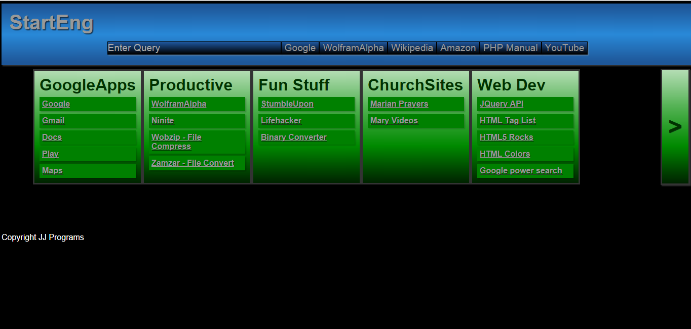

Custom Static Web Start Page
============================================

This is a custom start page that I made for my self a few years back. It was a fun project that I did to learn JavaScript. Looking back at it now, it is very impressive. I built it from the ground up without using any frameworks other then jQuery.

* Customizable Links (By editing the html, but it worked!)
* Links are grouped, group slide across the screen
* Link Groups autoexpand on mouse over. Which is still pretty neat.
* Customizable Search Engine
* Responsive By Design ( with out css, used JavaScript to resize everything)

Project Status
----------------------------------------
This project is dead. I have added to GitHub for memories reasons. Also I hope that possible someone might find it inspiring or helpful. Please feel free to take anything from the project.

Screen Shot
----------------------------------------------------------

License
---------------------------------------------
Released under the Beerware License. See License File for details.
